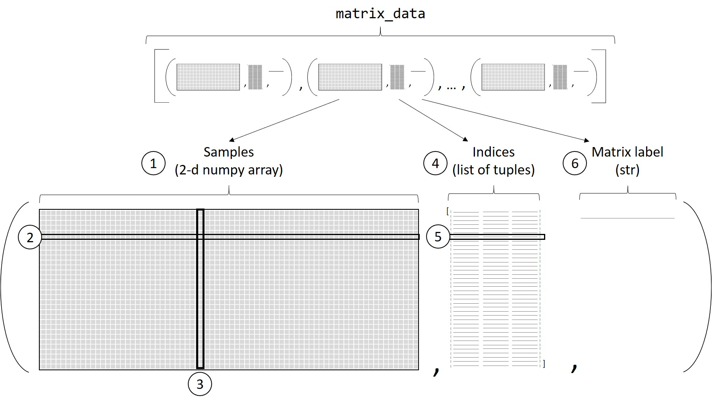
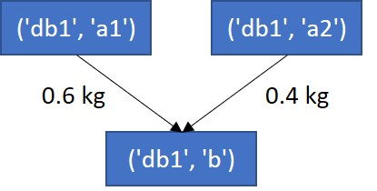
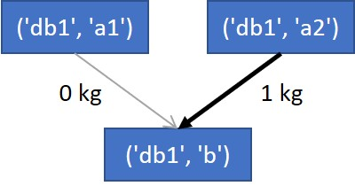
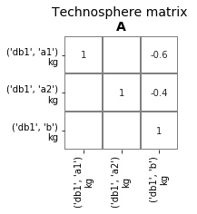
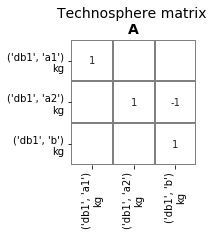
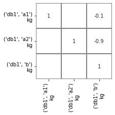
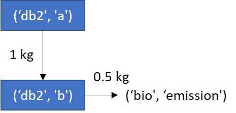
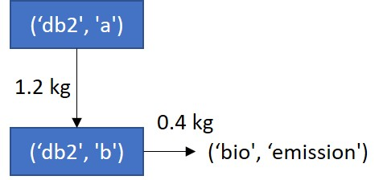
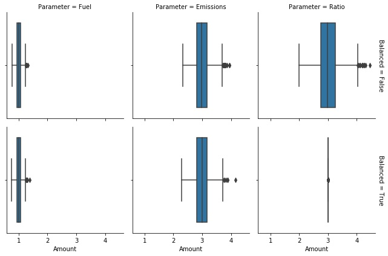

.. _use_with_bw2:

Using presamples with brightway2
================================

The presamples package is useful for writing, loading, managing and verifying presample arrays.

As shown `elsewhere <https://presamples.readthedocs.io/en/latest/quickstart.html>`_, this is useful to store reusable
arrays of values for named parameters. Presamples can also be used to store **arrays of values for given matrix elements**,
and to inject these in matrices when using them in calculations.

It was specifically geared towards matrices built by and used in the `Brightway2 framework <https://brightwaylca.dev/>`_,
though the code could be extended to work with any defined matrix.

This section provides an overview of the use of presamples in LCA. The first three sections provide a bit of context.
If you are more of a hands-on type of person, you can jump straight to the examples.
There is also a Notebook version of this documentation chapter, here.
It contains extra code for e.g. importing the data used the examples and formatting the outputs.

There are also more detailed use cases in the :ref:`examples` section.

* :ref:`bw2_intro`
* :ref:`bw2_basics`
* :ref:`bw2_matrix_data`
* :ref:`bw2_using_package`
* :ref:`bw2_eg1_change_supplier`
* :ref:`bw2_eg2_time_series`
* :ref:`bw2_eg3_biosphere_matrix`
* :ref:`bw2_eg4_overriding_in_MCs`
* :ref:`bw_todo`

.. _bw2_intro:

LCA matrices and the case for using presamples
---------------------------------------------------

At its barest expression, LCA models can be represented with three matrices and a vector:

 * the technosphere matrix **A**, describing the links among activities in the technosphere (technosphere exchanges)
 * the biosphere matrix **B**, satellite matrix describing the exchanges between the activities and the environment (elementary flows)
 * the characterization matrix **C**, giving unit impact factors for elementary flows with the environment (characterisation factors)
 * the final demand vector **f**

An impact score per functional unit is given by **g** = **CBA**\ :sup:`-1`\ **f**

Presamples can replace values in any these matrices as calculations are carried out.
Storing and injecting specific values in LCA matrices can improve LCA calculations in many ways:

  * Storing and reusing data characterizing given scenarios makes scenario analysis much easier.
  * It can easily integrate time series.
  * It can use pre-generated static or stochastic values that were generated by complex, non-linear models, allowing the
    LCA model to capture system dynamics more accurately.
  * It is possible to account to correlation across parameters during Monte Carlo Simulations (e.g. for correlation
    between characterization factors, between fuel use and CO2 emissions, etc.
  * Since sampled data can be used directly, it is unnecessary to fit data to a distribution.

.. _bw2_basics:

Creating and using presample packages with matrices in Brightway2
-------------------------------------------------------------------

.. _bw2_matrix_data:

Defining the input matrix_data
^^^^^^^^^^^^^^^^^^^^^^^^^^^^^^^^^^^^^^^^^^^

presamples packages contain the information needed to overwrite matrix elements with new values. To create a presamples
package, one passes ``matrix_data`` to ``create_presamples_package``. The structure of ``matrix_data`` is the ``matrix_data`` is a list of tuples containing **samples**, **indices** and a **matrix label**.

    Structure of ``matrix_data`` passed to ``create_presamples_package`` 

Where:

1. **samples** are a two-dimensional numpy array containing the actual data to be stored in a presamples package.
2. Each row of the **samples** array contains data (any number of values) for a given matrix element.
3. Each column of the **samples** array contains values that should be used together for all matrix elements. For example,
   one column can contain data for the different matrix elements for one scenario, for one time step or one Monte Carlo
   iteration.
4. **indices** is a list of tuples containing information that will allow the presamples package to map the data in
   samples to the correct matrix elements. How indices are defined will depend on the type of matrix.
5. The nth element in **indices** refers to the nth row in **samples**.
6. Finally, the **matrix label** is a string giving the name of the matrix to be modified (e.g. 'technosphere', 'biosphere', 'cf').

Creating the presamples package
^^^^^^^^^^^^^^^^^^^^^^^^^^^^^^^^^^^^^^^^^^^

Suppose you have already correctly defined some ``matrix_data`` (see `here <#defining-the-input-matrix-data>`_), creating
a presamples package is just as easy as for :ref:`named parameters <creating_presamples>`.

.. code-block:: python

    >>> import presamples as ps
    >>> pp_id, pp_path = ps.create_presamples_package(
    ...     matrix_data = some_well_defined_matrix_data,
    ... )

See :ref:`here <presamplepackagechapter>` for a description of all arguments.

.. _bw2_using_package:

Using a presamples package in LCA
^^^^^^^^^^^^^^^^^^^^^^^^^^^^^^^^^^^^^^^^^^^

Presample packages can directly be passed to Brightway2 ``LCA`` (and, by extension, ``MonteCarloLCA``) objects.
Brightway2 will replace the appropriate matrix elements with the data contained in the presample package.
This is done by simply passing a list of *paths* to presample packages in the ``LCA`` object:

.. code-block:: python

    >>> import brightway2 as bw
    >>> LCA = bw.LCA({activity: amount}, presamples=[pp_path])

That is it.

.. _bw2_eg1_change_supplier:

Example 1 - Static scenario analysis: changing supplier by modifying the technoshere matrix
-----------------------------------------------------------------------------------------------

Context
^^^^^^^^^^^^^^^^^^^^^^^^^^^^^^^^^^^^^^^^^^^

Take the example of producer ``('bd1', 'b')`` that purchases product *a* from two suppliers,
``('bd1', 'a1')`` and ``('bd1', 'a2')``.

.. note::
    To better align with Brightway2, the activities are referred to by their activity *key*,
    which is a tuple made up of:

    - their database (in this case, ``'bd1'``)
    - their activity code (in this case, one of ``'a1'``, ``'a2'`` or ``'b'``).

    Initial product system 

Suppose that producer ``('bd1', 'b')`` decides to change (in simulation or in reality) its supplier of *a* to ``('bd1', 'a2')``.

    Product system after change of supplier

In the LCA model, these changes occur in the technosphere matrix **A**.
Originally, the **A** matrix looks like this:

    Technosphere matrix before changing supplier

The decision to start purchasing *a* exclusively from ``('bd1', 'a2')`` translates to the following changes in the
technosphere matrix:

* changing the -0.6 value at element ``('bd1', 'a1')``, ``('bd1', 'b')`` to 0
* changing the -0.4 value at element ``('bd1', 'a2')``, ``('bd1', 'b')`` to 1

We can create a presamples package with this new data in order to override existing data with these new values
in the context of an LCA.

Creating the ``matrix_data``
^^^^^^^^^^^^^^^^^^^^^^^^^^^^^^^^^^^^^^^^^^^

The first step is to create the ``matrix_data``:

1) The samples array is simply a numpy array with one column (we are modelling one new scenario) and two rows
   (we want to modify two values in the **A** matrix). Note that the values are positive, even if the values in the
   **A** matrix are actually negative. Presamples will know to flip the signs:

.. code-block:: python

    >>> import numpy as np
    >>> scenario_array = np.array(
        [
            1,    # New value for exchange between ('bd1', 'a2') and ('bd1', 'b')
            0     # New value for exchange between ('bd1', 'a1') and ('bd1', 'b')
        ]).reshape(-1, 1)

2) The indices are defined as a list of tuples, with each tuple containing:

   - the activity key of the input (the supplier)
   - activity key of the output (the consumer)
   - the type of exchange, necessary for elements ot the technosphere matrix because exchanges can be of various types
     ('technosphere', 'production' or 'substitution'). In this case, the exchange type is 'technosphere', and this is
     how presamples knows to flip the signs of the values in the samples.

.. code-block:: python

    >>> scenario_indices = [
            (('bd1', 'a2'), ('bd1', 'b'), 'technosphere'),
            (('bd1', 'a1'), ('bd1', 'b'), 'technosphere')
        ]

3) The name of the matrix, simply ``'technosphere'``.

The ``matrix_data`` is therefore:

.. code-block:: python

    >>> scenario_matrix_data = [(scenario_array, scenario_indices, 'technosphere')]

Creating the presamples package
^^^^^^^^^^^^^^^^^^^^^^^^^^^^^^^^^^^^^^^^^^^

The presamples package is created as follows:

.. code-block:: python

    >>> import presamples as ps
    >>> scen_pp_id, scen_pp_path = ps.create_presamples_package(
    ...     matrix_data = scenario_matrix_data,
    ... )

Using the presamples package
^^^^^^^^^^^^^^^^^^^^^^^^^^^^^^^^^^^^^^^^^^^

The presamples package can directly be passed to an LCA object.

.. code-block:: python

    >>> import brightway2 as bw
    >>> lca = bw.LCA(demand={('bd1', 'b'): 1}, presamples=[scen_pp_path])

This will load the presample packages, which will be accessible as an attribute of the lca object, ``lca.presamples``.

.. code-block:: python

    >>> lca.presamples
    <presamples.loader.PackagesDataLoader at 0x17eac8790b8>

However, you will probably never have to interact with the PackagesDataLoader directly.

The technosphere and biosphere matrices are built with the ``LCA.load_lci_data`` method,
normally invoked by the ``LCA.lci`` method.

.. code-block:: python

    >>> lca.load_lci_data()

The technosphere matrix in this specific LCA is:

    Technosphere matrix after changing supplier with presamples package

The changes made are not persistent: they are only applied to this ``LCA`` object, and not to the database proper.

.. _bw2_eg2_time_series:

Example 2: Using presamples for time series
---------------------------------------------------

Context
^^^^^^^^^^^^^^^^^^^^^^^^^^^^^^^^^^^^^^^^^^^

Using the same product system as in Example 1, suppose that the sourcing of product *a* from the two suppliers
varies in time. This type of situation happens e.g. with electricity grid mixes, where the contribution to the grid of
different technologies varies in time.

Suppose we want to calculate LCA results per month, knowing the following:

.. csv-table:: Purchases of product *a* from two suppliers
   :header: "Date", "('db1', 'a1')", "('db1', 'a2')", "Sum"
   :widths: 5, 5, 5, 5

    "Jan-19",	0.9,	0.1,	1.0
    "Feb-19",	0.8,	0.2,	1.0
    "Mar-19",	0.6,	0.4,	1.0
    "Apr-19",	0.3,	0.7,	1.0
    "May-19",	0.6,	0.4,	1.0
    "Jun-19",	0.5,	0.5,	1.0

Creating the ``matrix_data``
^^^^^^^^^^^^^^^^^^^^^^^^^^^^^^^^^^^^^^^^^^^

We first reorganize the data as a numpy array:

.. code-block:: python

    >>> time_array = np.array(
    ...     [
    ...         [0.9, 0.8, 0.6, 0.3, 0.6, 0.5],
    ...         [0.1, 0.2, 0.4, 0.7, 0.4, 0.5]
    ...     ]
    ... )
    >>> time_array.shape
    (2, 6)

The indices are the same as in the previous example:

.. code-block:: python

    >>> time_indices = [
            (('bd1', 'a2'), ('bd1', 'b'), 'technosphere'),
            (('bd1', 'a1'), ('bd1', 'b'), 'technosphere')
        ]

The name of the matrix is again simply ``'technosphere'``.

The ``matrix_data`` is therefore:

.. code-block:: python

    >>> time_matrix_data = [(time_array, time_indices, 'technosphere')]

Creating the presamples package
^^^^^^^^^^^^^^^^^^^^^^^^^^^^^^^^^^^^^^^^^^^

To create the presamples package, we again use ``create_presamples_package``:

.. code-block:: python

    >>> time_pp_id, time_pp_path = ps.create_presamples_package(
    ...     matrix_data = time_matrix_data,
    ...     seed='sequential'
    ... )

Using the presamples package in an LCA
^^^^^^^^^^^^^^^^^^^^^^^^^^^^^^^^^^^^^^^^^^^

The presamples package is again passed directly to the ``LCA`` object:

.. code-block:: python

    >>> lca = bw.LCA(demand={('bd1', 'b'): 1}, presamples=[time_pp_path])

The first time the ``lci`` method is invoked, the first column of the array is injected in the matrices
(because the presamples package seed is ``'sequential'``, and so the column ``index`` starts at 0).
The technology matrix is therefore:

    Technosphere matrix after invoking ``lca.lci()`` once

If the ``lci`` method is called again, the values are not modified, and the ``index`` remains 0.
To advance to the next index, the ``lca.presamples.update_matrices()`` needs to be called:

.. code-block:: python

    >>> lca.presamples.update_matrices()

    Technosphere matrix after updating matrices once

Each time ``lca.presamples.update_matrices()`` is called, the index goes up by 1 (again, because the seed is sequential)
and the matrices are updated.

.. code-block:: python

    >>> lca = bw.LCA({('db1', 'b'):1}, presamples=[time_pp_path])
    >>> for i in range(10):
    ...     if i == 0: # Don't update the first time around, since indexer already at 0th column
    ...         lca.lci() # Builds matrices, and injects values from first column of presamples package
    ...     else:
    ...         lca.presamples.update_matrices() # Move to next column and update matrices
    ...     # Get value of input to ('db1', 'b') from supplier ('db1', 'a1')
    ...     from_a1 = lca.technosphere_matrix[
    ...         lca.product_dict[('db1', 'a1')], # row index in A for ('db1', 'a1')
    ...         lca.activity_dict[('db1', 'b')]  # col index in A for ('db1', 'b')
    ...     ]
    ...     # Get value of input to ('db1', 'b') from supplier ('db1', 'a2')
    ...     from_a2 = lca.technosphere_matrix[
    ...         lca.product_dict[('db1', 'a2')], # row index in A for ('db1', 'a2')
    ...         lca.activity_dict[('db1', 'b')]  # col index in A for ('db1', 'b')
    ...     ]
    ...     # Get index value for printing - normally one doesn't interact with lca.presamples
    ...     index_value = lca.presamples.matrix_indexer[0].index
    ...     print(i,"\t\t", index_value,"\t\t", from_a1,"\t\t", from_a2)

    Times updated	Index value	    Input from a1	Input from a2
    0 		        0 		        -0.1 		    -0.9
    1 		        1 		        -0.2 		    -0.8
    2 		        2 		        -0.4 		    -0.6
    3 		        3 		        -0.7 		    -0.3
    4 		        4 		        -0.4 		    -0.6
    5 		        5 		        -0.5 		    -0.5
    6 		        0 		        -0.1 		    -0.9
    7 		        1 		        -0.2 		    -0.8
    8 		        2 		        -0.4 		    -0.6
    9 		        3 		        -0.7 		    -0.3

Note that the indexer starts back at 0 when all columns have been consumed.

The typical use would therefore be something like this:

.. code-block:: python

    >>> lca = bw.LCA({('db1', 'b'):1}, presamples=[time_pp_path], method=("mock method", "pollutant emission"))
    >>> for i in range(6):
    ...     if i == 0:
    ...         lca.lci()
    ...         lca.lcia()
    ...     else:
    ...         lca.presamples.update_matrices()
    ...         lca.redo_lci()
    ...         lca.redo_lcia()
    ...     print(i, lca.score)

    0 1.1
    1 1.2
    2 1.4
    3 1.7
    4 1.4
    5 1.5

Note that behaviour presented in this example will only work with presample packages that have the ``'sequential'`` seed.
Here is an example where the seed is instead some integer, 42.

.. code-block:: python

    >>> time_not_seq_pp_id, time_not_seq_pp_path = ps.create_presamples_package(
    ...     matrix_data=time_matrix_data,
    ...     seed=42
    ... )
    >>> lca = bw.LCA({('db1', 'b'):1}, presamples=[time_not_seq_pp_path])
    >>> for i in range(10):
    ...     if i == 0: # Don't update the first time around, since indexer already at 0th column
    ...         lca.lci() # Builds matrices, and injects values from first column of presamples package
    ...     else:
    ...         lca.presamples.update_matrices() # Move to next column and update matrices
    ...     # Get value of input to ('db1', 'b') from supplier ('db1', 'a1')
    ...     from_a1 = lca.technosphere_matrix[
    ...         lca.product_dict[('db1', 'a1')], # row index in A for ('db1', 'a1')
    ...         lca.activity_dict[('db1', 'b')]  # col index in A for ('db1', 'b')
    ...     ]
    ...     # Get value of input to ('db1', 'b') from supplier ('db1', 'a2')
    ...     from_a2 = lca.technosphere_matrix[
    ...         lca.product_dict[('db1', 'a2')], # row index in A for ('db1', 'a2')
    ...         lca.activity_dict[('db1', 'b')]  # col index in A for ('db1', 'b')
    ...     ]
    ...     # Get index value for printing - normally one doesn't interact with lca.presamples
    ...     index_value = lca.presamples.matrix_indexer[0].index
    ...     print(i,"\t\t", index_value,"\t\t", from_a1,"\t\t", from_a2)

    Times updated	Index value	    Input from a1	Input from a2
    0 		        0 		        -0.1 		    -0.9
    1 		        3 		        -0.7 		    -0.3
    2 		        2 		        -0.4 		    -0.6
    3 		        4 		        -0.4 		    -0.6
    4 		        4 		        -0.4 		    -0.6

.. _bw2_eg3_biosphere_matrix:

Example 3 - Modifying emission data by modifying the biosphere matrix
-----------------------------------------------------------------------------------------------

Context
^^^^^^^^^^^^^^^^^^^^^^^^^^^^^^^^^^^^^^^^^^^
Say a producer ('bd2', 'b') wants to estimate the environmental impacts of a process change that will affect both the
amount of an input ('bd2', 'a') and the amount of emission ('bio', 'emission').

    Example 3, before emission reduction strategy  

    Example 3, after emission reduction strategy  

Note: for simplicity, the emissions of unit process ('bd2', 'a') (0.5 kg/kg a) are not shown in the diagram.

Creating the ``matrix_data``
^^^^^^^^^^^^^^^^^^^^^^^^^^^^^^^^^^^^^^^^^^^

We can model this scenario using presamples. This time, we need to provide ``matrix_data`` for both the technosphere and
biosphere exchanges.

.. code-block:: python

    >>> eg3_matrix_data = [
    ...     (
    ...         np.array([1.2]).reshape(1, 1), # Only one value, but array still needs to have two dimensions
    ...         [(('db2', 'a'), ('db2', 'b'), 'technosphere')],
    ...         'technosphere'
    ...     ),
    ...     (
    ...         np.array([0.4]).reshape(1, 1), # Again, only one value
    ...         [(('bio', 'emission'), ('db2', 'b'))], # No need to specify the exchange type
    ...         'biosphere'
    ...     ),
    ... ]

Note that there was no need to specify the exchange type in the indices for the biosphere matrix because there is only
one type of exchange in the biosphere matrix.

Creating the presamples package
^^^^^^^^^^^^^^^^^^^^^^^^^^^^^^^^^^^^^^^^^^^

To create the presamples package, we again use ``create_presamples_package``:

.. code-block:: python

    >>> eg3_pp_id, eg3_pp_path = ps.create_presamples_package(
    ...     matrix_data = eg3_matrix_data,
    ... )

Using the presamples package in an LCA
^^^^^^^^^^^^^^^^^^^^^^^^^^^^^^^^^^^^^^^^^^^

Passing the path to the presamples package when instantiating an ``LCA`` object will automatically ready the package data,
and calling the ``lci`` method will inject the presample package value in the appropriate matrices:

.. code-block:: python

    >>> lca1 = bw.LCA(
    ...     {('db2', 'b'):1},
    ...     method=('mock method', 'pollutant emission'),
    ...     presamples=[eg3_pp_path]
    ... )
    >>> lca1.lci()
    >>> lca1.lcia()

To compare with LCA result of the baseline model, simply create another LCA object without presamples:

.. code-block:: python

    >>> lca0 = bw.LCA({('db2', 'b'):1}, method=('mock method', 'pollutant emission'))
    ...     {('db2', 'b'):1},
    ...     method=('mock method', 'pollutant emission')
    ... )
    >>> lca0.lci()
    >>> lca0.lcia()
    >>> lca1.score / lca0.score
    0.909

.. _bw2_eg4_overriding_in_MCs:

Example 4 - Balancing sampled exchange values
-----------------------------------------------------------------------------------------------

Context
^^^^^^^^^^^^^^^^^^^^^^^^^^^^^^^^^^^^^^^^^^^

To account for variability in particular and uncertainty in general, exchanges can be represented by probability functions.
These probability functions can then be propagated using e.g. Monte Carlo Simulations.

Sometimes, exchanges that are correlated in reality are independently sampled. This is the case for fuel consumption
and combustion emissions if are represented by probability functions.

Take the following example, loosely based on a dataset from ecoinvent v2.2, where the fuel is diesel and the emission
is CO2:

  - for every kg of fuel input, there are 3 kg of emission
  - fuel input is lognormally distributed with a GSD2 of 1.2
  - emissions are lognormally distributed with a GSD2 of 1.2
  - the cradle-to-gate emissions of fuel production are also lognormally distributed with a GSD2 of 1.2

If we sample all these values independently, the ratio of combustion emission to fuel input will always be off:

.. code-block:: python

   >>> mc = bw.MonteCarloLCA({('db3', 'a'):1}, method=("mock method", "pollutant emission"))
   >>> print("Fuel\t\tEmission\tRatio")
   >>> for _ in range(10):
   ...    arr[_]=next(mc)
   ...    fuel = mc.technosphere_matrix[
   ...        mc.product_dict[('db3', 'fuel')],
   ...        mc.activity_dict[('db3', 'a')],
   ...    ]
   ...    emission = mc.biosphere_matrix[
   ...        mc.biosphere_dict[('bio', 'emission')],
   ...        mc.activity_dict[('db3', 'a')],
   ...    ]
   ...    print("{:.3}\t\t{:.3}\t\t{:.6}".format(-fuel, emission, -emission/fuel))
   Fuel		Emission	Ratio
   1.11		3.32		3.0
   1.02		2.91		2.84968
   0.969	3.5 		3.61066
   0.855	2.92		3.42095
   1.17		2.77		2.37436
   1.13		3.04		2.69255
   0.975	2.78		2.84856
   0.881	3.35		3.79877
   0.923	2.81		3.03841
   0.966	3.04		3.14529

Defining matrix data
^^^^^^^^^^^^^^^^^^^^^^^

We can create samples for fuel consumption, and then calculate combustion emissions as a function of fuel consumption.

.. code-block:: python

    >>> import numpy as np
    >>> fuel_consumption = np.random.lognormal(mean=np.log(1), sigma=np.log(np.sqrt(1.2)), size=1000)
    >>> emissions = fuel_consumption * 3

We then define ``matrix_data`` for these exchanges. Here, we use the ``split_inventory_presamples`` helper function, which
allows us to pass biosphere and technosphere samples together. Note that you need to specify the exchange type
for biosphere exchanges when using this function.

.. code-block:: python

    >>> balanced_samples = np.stack([fuel_consumption, emissions], axis=0)
    >>> balanced_indices = [
    ...    (('db3', 'fuel'), ('db3', 'a'), 'technosphere'),
    ...    (('bio', 'emission'), ('db3', 'a'), 'biosphere'),
    ... ]
    >>> matrix_data = ps.split_inventory_presamples(balanced_samples, balanced_indices)
    >>> bio_data = matrix_data[0] # matrix_data for biosphere exchanges comes first
    >>> bio_data[0][0, 0:10], bio_data[1], bio_data[2] # Show that we get what we expected
    (array([3.30923763, 2.88238829, 2.82005106, 2.92788522, 2.86454275,
            3.41350596, 3.03328453, 2.97565299, 2.9725899 , 2.91354418]),
    [(('bio', 'emission'), ('db3', 'a'))],
    'biosphere')
    >>> techno_data = matrix_data[1]
    >>> techno_data[0][0, 0:10], techno_data[1], techno_data[2] # Show that we get what we expected
    (array([1.10307921, 0.9607961 , 0.94001702, 0.97596174, 0.95484758,
            1.13783532, 1.01109484, 0.99188433, 0.9908633 , 0.97118139]),
    [(('db3', 'fuel'), ('db3', 'a'), 'technosphere')],
    'technosphere')

Creating and using the presamples package matrix data
^^^^^^^^^^^^^^^^^^^^^^^^^^^^^^^^^^^^^^^^^^^^^^^^^^^^^^^^^^^^^^

.. code-block:: python

    >>> balanced_id, balanced_path = ps.create_presamples_package(
            matrix_data=ps.split_inventory_presamples(balanced_samples, balanced_indices)
        )
    >>> mc_balanced = bw.MonteCarloLCA({('db3', 'a'):1}, presamples=[balanced_path])

Two ``MonteCarloLCA`` objects were generated: one without presamples (unbalanced), where fuel consumption and combustion
emissions are independently sampled, and one with presamples (balanced), defined as above.
For each, 1000 iterations were taken, and for each iteration, the fuel consumption and combustion emission were
lifted from technosphere and biosphere matrices. We can see that the emission to fuel ratio is respected in all iterations
for the balanced ``MonteCarloLCA`` object, but never for the unbalanced ``MonteCarloLCA`` object.

    Example 4, Fuel consumption and combustion emissions for balanced (using presamples) and unbalanced ``MonteCarloLCA`` objects

Real cases
^^^^^^^^^^^^

This type of balancing is especially relevant for exchanges that are independently sampled and for which the ratio or
balance is key to assessing the environmental impacts. Two cases are water exchanges and land transformation exchanges.
Specific modules, built on brightway2 and presamples, have been developed for these cases specifically:
`bw2waterbalancer <https://github.com/CIRAIG/bw2waterbalancer>`_ and `bw2landbalancer <https://github.com/CIRAIG/bw2landbalancer>`_

.. _bw_todo:

Other uses to document
-----------------------------------------------------------------------------------------------

The documentation is not complete. The following items are still missing:

  - Kronocker delta helper function, useful for sampling one supplier from a market at each Monte Carlo iteration
  - Fixed sums, useful for balancing markets
  - Using presamples to store dependently sampled, preaggregated LCI for a whole LCI database
  - Using presamples *resources* to store scenarios for easy reuse
  - Using campaigns to efficiently manage presample resources
  - Using Parameterized brightway models to combine parameter and matrix presamples in actual brightway2 models

